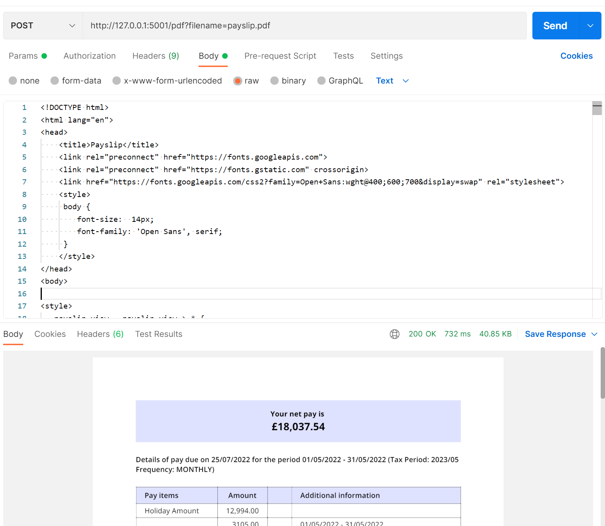

# docker-weasyprint

[](https://travis-ci.org/aquavitae/docker-weasyprint)

[Weasyprint](http://weasyprint.org/) as a microservice in a docker image.

# Usage

Run the docker image, exposing port 5001

```
docker run -p 5001:5001 --name weasyprint alcintra/weasyprint-docker:latest
```


Simple use: `POST` to port `/pdf` on port 5001 with an html body will return a response containing a PDF. 

`http://127.0.0.1:5001/pdf?filename=payslip.pdf`

This will return a response with `Content-Type: application/pdf` and `Content-Disposition: inline; filename=result.pdf` headers.  The body of the response will be the PDF.



In addition `/health` is a health check endpoint and a `GET` returns 'ok'.
